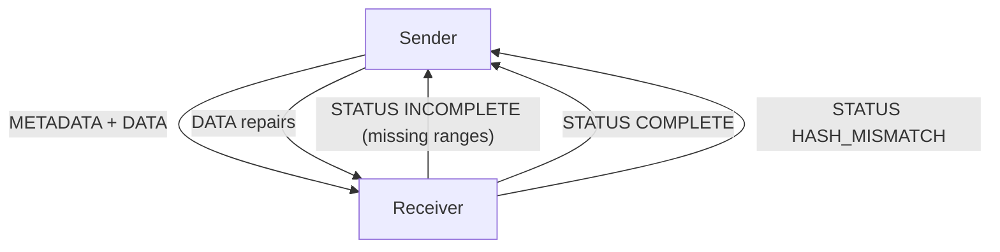

# SSYNC Architecture Evaluation

This document captures the current architecture-evaluation roadmap for evolving
SSYNC control flow and terminology while preserving operational reliability on
asymmetric, intermittent links.

## Scope And Objectives

Primary objectives:

- rename `MANIFEST` to `METADATA` across protocol language and code-facing names
- converge control-plane behavior on a versatile receiver-driven `STATUS` model
- enable late-join recovery via periodic metadata and pre-metadata chunk buffering

Non-goals for this phase:

- immediate wire-breaking protocol changes
- implementation details beyond design-level interfaces and rollout strategy
- changing data-plane `DATA` semantics

## 1) Idea Backlog (From Recent Architecture Sessions)

1. **Terminology clarity**
   - `MANIFEST` is technically correct but `METADATA` is more intuitive.
   - Preferred direction: treat `METADATA` as the canonical term.
2. **Control-plane simplification**
   - Explore a single rich `STATUS` packet replacing or subsuming:
     - `FIN`
     - `REPAIR_REQUEST`
     - `REPAIR_DONE`
     - `TRANSFER_COMPLETE`
3. **Late-join behavior**
   - Sender should emit metadata periodically, not only at transfer start.
   - Receiver should buffer unknown-transfer chunks until metadata arrives.
   - Once metadata arrives, receiver should infer early missing ranges and request repair.
4. **Receiver as control authority**
   - Keep `STATUS` primarily receiver-originated.
   - Sender reacts to receiver state rather than owning completion authority.
5. **Deterministic convergence**
   - Preserve explicit convergence and avoid timer-only ambiguity under impairments.

## 2) Compatibility Policy (MANIFEST -> METADATA And Legacy Coexistence)

## 2.1 Naming Policy

- **User-facing canonical term**: `METADATA`
- **Migration alias**: retain `MANIFEST` naming internally where required during transition

## 2.2 Wire-Compatibility Strategy

Adopt a phased, non-breaking rollout:

- **Phase A (dual terminology, stable wire)**
  - Keep existing frame type numeric values.
  - Add code aliases:
    - `TransferMetadata` aliasing `TransferManifest` (or equivalent)
    - `encode_metadata` / `decode_metadata` wrappers around existing codec behavior
  - Update docs/log text to prefer `METADATA`.
- **Phase B (capability-negotiated behavior)**
  - Add sender capability advertisement in metadata TLVs.
  - Receiver indicates support through existing feedback channel semantics.
- **Phase C (optional wire cleanup)**
  - If desired later, reserve a distinct `METADATA` frame type in a new protocol version.
  - Keep backward decoding path for previous deployments until deprecation window ends.

## 2.3 Deprecation Policy

- Keep legacy names and control frames available for at least one full release cycle.
- Deprecate by warning first, then remove after compatibility gate criteria are met.

## 3) Unified STATUS Control Model (Design)

`STATUS` becomes the single control-plane envelope from receiver to sender.

## 3.1 Proposed STATUS Semantics

Recommended status classes:

- `INCOMPLETE` + `missing_ranges`
  - Authoritative request for retransmission ranges.
- `COMPLETE`
  - Authoritative terminal success.
- `HASH_MISMATCH`
  - Authoritative terminal integrity failure.
- `PENDING_METADATA` (optional extension)
  - Receiver has buffered data but cannot hydrate transfer state yet.
- `KEEPALIVE` (optional extension)
  - Liveness/advisory without changing transfer state.

## 3.2 Invariants

- Receiver is authoritative for transfer completeness.
- Sender never marks completion without receiver terminal signal.
- Repeated `STATUS` frames must be idempotent.
- Missing range semantics remain half-open and normalized.
- Terminal states are monotonic (`COMPLETE` and `HASH_MISMATCH` are final).

## 3.3 Legacy Frame Mapping

During coexistence:

- `REPAIR_REQUEST` -> translate to `STATUS(INCOMPLETE, missing_ranges=...)`
- `TRANSFER_COMPLETE` -> translate to `STATUS(COMPLETE)`
- `FIN`/`REPAIR_DONE` are treated as compatibility hints, not authority

## 3.4 State Transition View

## 4) Periodic METADATA And Pre-METADATA Buffering

## 4.1 Sender Periodic Metadata Cadence

Support both policy knobs:

- chunk-based cadence: send metadata every `N` data chunks
- time-based cadence: send metadata every `T` seconds while transfer active

Guardrails:

- minimum interval to avoid control-plane flooding
- automatic cadence backoff under high retransmit pressure

## 4.2 Receiver Pre-Metadata Buffer Model

When `DATA` arrives for unknown transfer ID:

- store in a bounded pending buffer keyed by `transfer_id`
- do not treat payload as committed transfer state yet
- optionally note `FIN-seen` flag for that transfer ID

On metadata arrival:

1. validate metadata fields
2. instantiate transfer state
3. replay buffered chunks through normal validation/write path
4. compute missing ranges across full declared chunk space
5. emit `STATUS(INCOMPLETE)` if gaps exist; otherwise finalize and emit terminal status

## 4.3 Resource Safety

Required limits:

- max pending bytes (global)
- max pending bytes per transfer
- max pending transfer IDs
- entry TTL expiration
- duplicate chunk policy (keep first or newest; pick one and enforce consistently)

Failure handling:

- if limits exceeded, evict oldest/least-recent and emit telemetry counters
- never crash on malformed or out-of-order pre-metadata data

## 5) Phased Rollout Plan

1. **Design-only ADR stage**
   - ratify status model, compatibility rules, and buffer safety constraints.
2. **Compatibility implementation stage**
   - add aliases and translation paths without removing legacy behavior.
3. **Controlled enablement stage**
   - feature flag for unified-status mode.
   - run dual-path telemetry in impairment tests.
4. **Default switch stage**
   - make unified-status flow default once convergence/error SLOs are met.
5. **Legacy retirement stage**
   - remove legacy control frame dependencies after deprecation window.

## 6) Validation Checklist

Core functional checks:

- single-file success and multi-file batch success
- zero-byte file handling
- late-join transfer (receiver starts mid-stream)
- repeated metadata handling with no state corruption
- inferred early-range repair request correctness

Impairment and resilience checks:

- asymmetric bandwidth + delay + jitter
- return-link loss/corruption spikes
- intermittent contact windows
- duplicate/reordered control frames

Safety checks:

- bounded memory under adversarial unknown transfer IDs
- deterministic eviction behavior
- no deadlock when pre-metadata buffer is full

Compatibility checks:

- old sender/new receiver
- new sender/old receiver
- mixed control-frame presence in same run

## 7) Deliverable Summary

This evaluation defines:

- architecture backlog and direction
- compatibility/deprecation policy for naming and control-plane evolution
- target unified `STATUS` state model and invariants
- periodic metadata + pre-metadata buffering design
- phased rollout and validation gates

A concrete implementation plan can be derived directly from this document once
the architecture decisions are approved.
