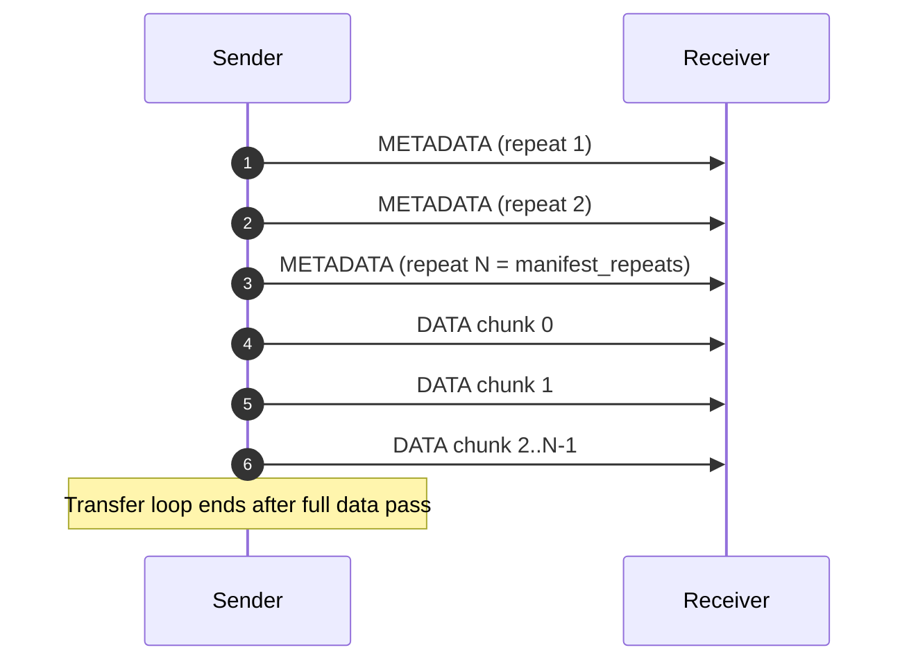
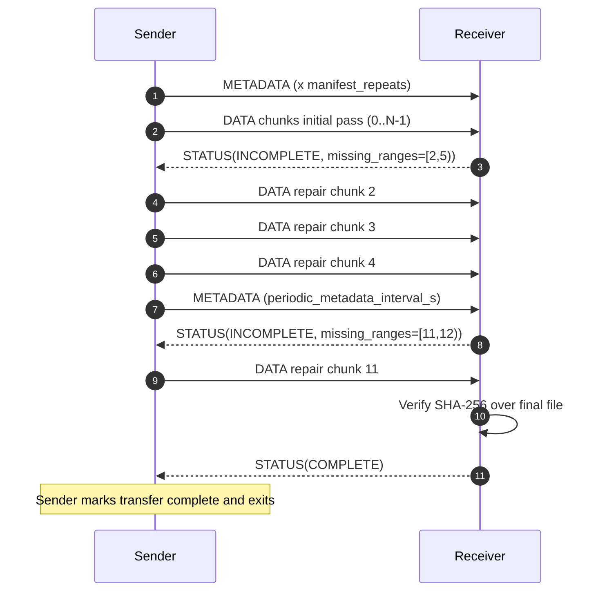
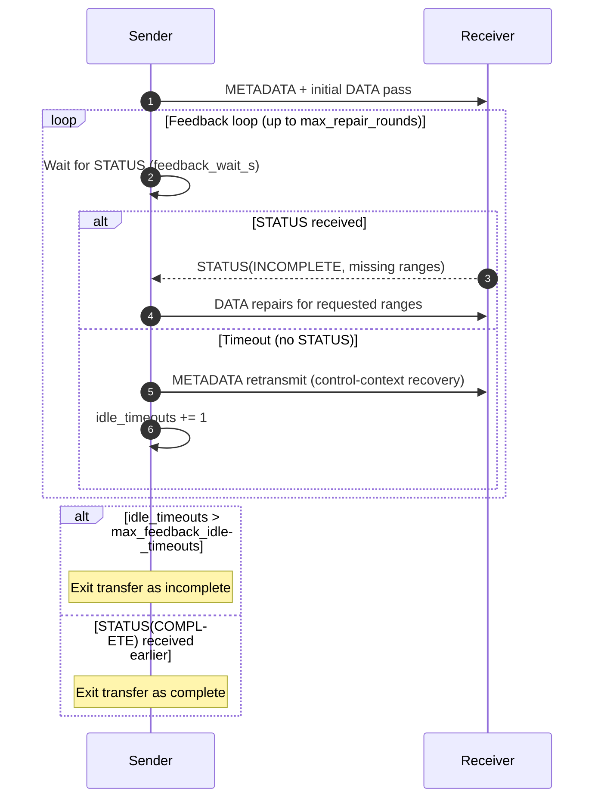
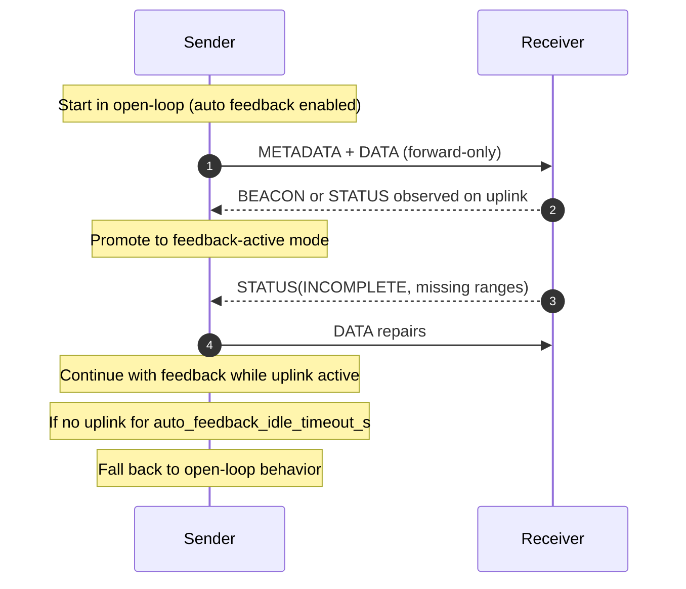
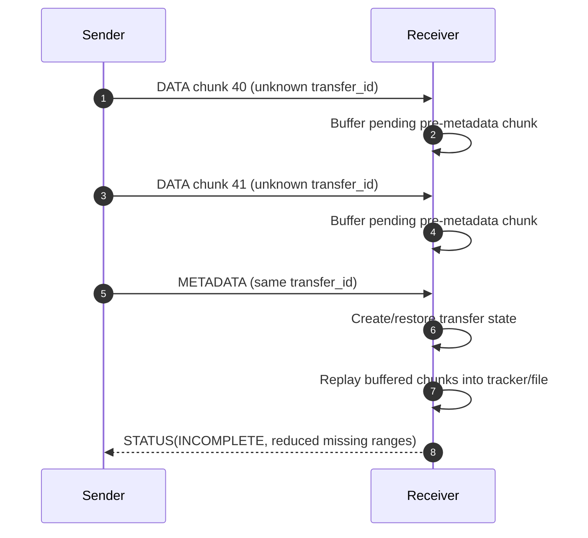
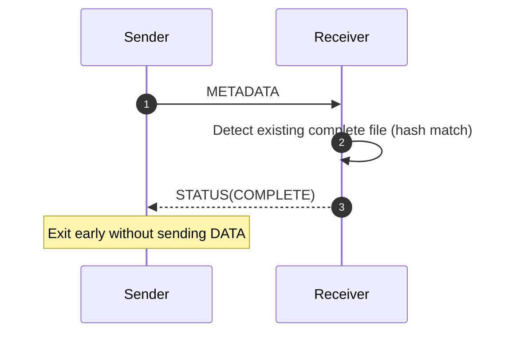
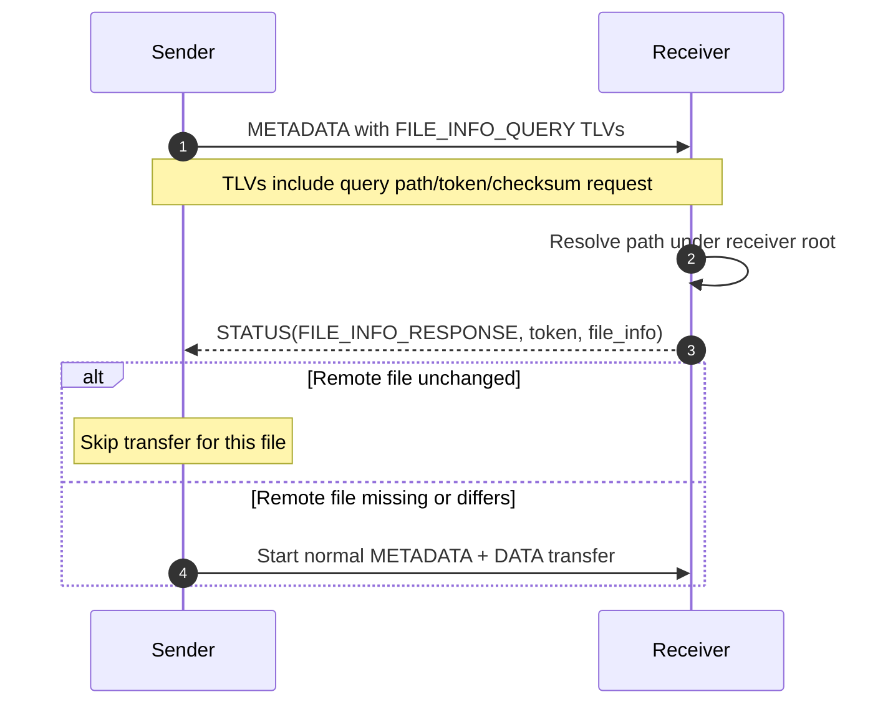
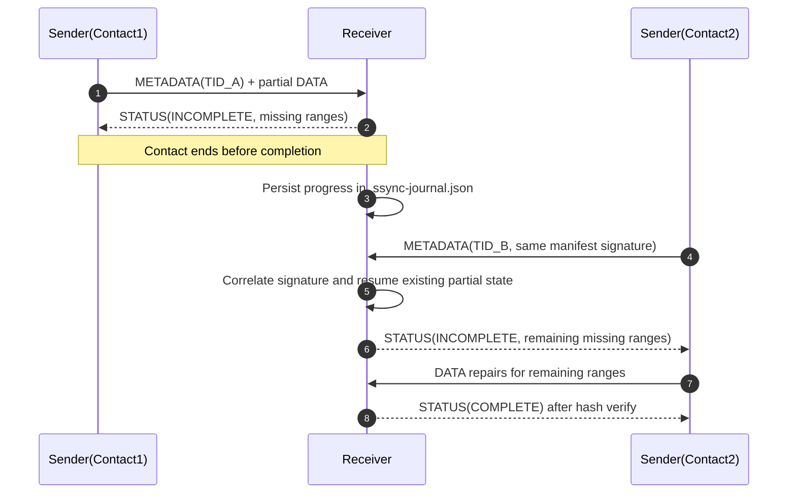
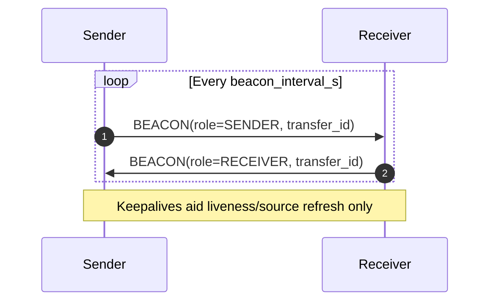

# SSYNC Protocol Sequence Diagrams

This document captures the primary SSYNC protocol exchanges as Mermaid sequence diagrams.
It complements the wire-format and behavior details in the transport draft.

## 1) Open-Loop Transfer (No Feedback)

In open-loop mode, the sender does not rely on a return path. It sends repeated
`METADATA`, then streams all `DATA` chunks and exits. `manifest_repeats` controls
metadata repetition.

## 2) Feedback Mode (Happy Path)

In feedback mode, receiver-driven repair is sparse and range-based. The sender
periodically re-emits `METADATA` (`periodic_metadata_interval_s`) while sending data.
The receiver completes after whole-file SHA-256 verification and emits `STATUS(COMPLETE)`.

## 3) Feedback Mode: Repair Rounds and Timeout Exit

This flow shows timeout-driven metadata refresh and bounded repair loops.
`feedback_wait_s` controls per-wait timeout; sender stops after
`max_feedback_idle_timeouts` consecutive idle waits or `max_repair_rounds`.

## 4) Auto Feedback Discovery and Fallback

The top-level sync workflow can begin open-loop, promote to feedback when uplink
activity is observed, and fall back to open-loop on prolonged uplink idle
(`auto_feedback_idle_timeout_s`).

## 5) Pre-Metadata Buffering

When `DATA` arrives before `METADATA`, receiver can buffer bounded chunks keyed
by transfer ID (`pre_metadata_max_pending_bytes`, per-transfer limits, TTL).
After metadata arrives, buffered chunks are replayed.

## 6) Short-Circuit When File Already Complete

If receiver already has a matching completed file for the manifest signature
(file size, chunk size, SHA-256, file name), it can immediately return
`STATUS(COMPLETE)` and avoid data transfer.

## 7) File Info Query for Skip-Unchanged

For sync pre-check (`--skip-unchanged`, optionally `--checksum`), sender can
query remote file information using `METADATA` TLVs and receive
`STATUS(FILE_INFO_RESPONSE)`.

## 8) Deferred Repair Across Contacts (Journal Resume)

Receiver persists incomplete transfer state in `.ssync-journal.json`. On a later
contact, sender may use a new transfer ID for the same file; receiver correlates
by manifest signature and resumes coverage.

## 9) Beacon Keepalive

`BEACON` frames are optional keepalives (`beacon_interval_s`). They are used for
availability and source-address freshness and do not directly complete transfers.

## Related References

- [`docs/draft-space-sync-transport-00.md`](docs/draft-space-sync-transport-00.md)
- [`src/ssync/space_sync/frames.py`](src/ssync/space_sync/frames.py)
- [`src/ssync/space_sync/types.py`](src/ssync/space_sync/types.py)
- [`src/ssync/space_sync/sender.py`](src/ssync/space_sync/sender.py)
- [`src/ssync/space_sync/receiver.py`](src/ssync/space_sync/receiver.py)
